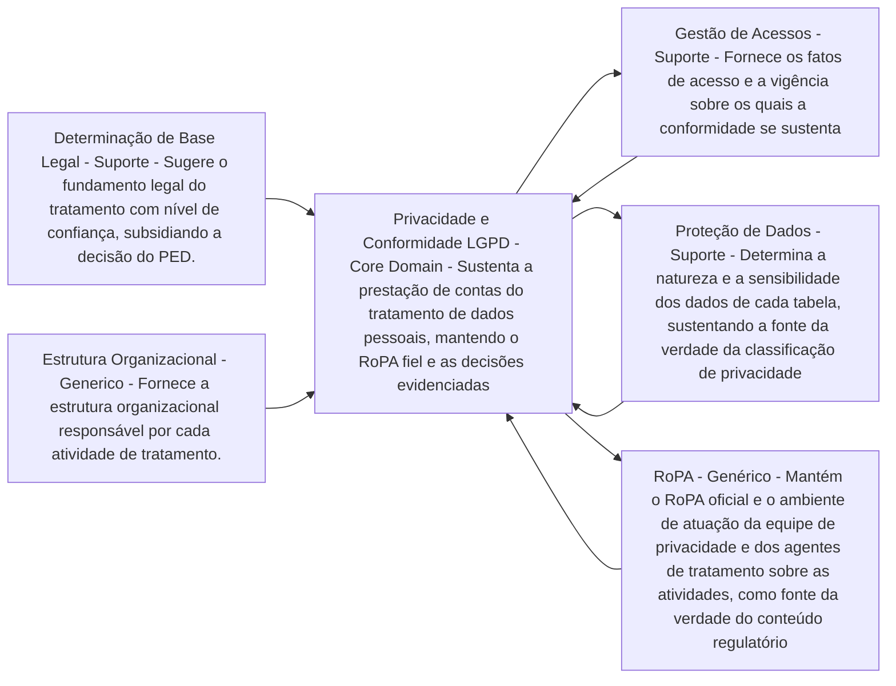

```mermaid
---
config:
  layout: dagre
---
flowchart LR
    ContextPrivacidadeEConformidade["Privacidade e Conformidade LGPD - Core Domain - Sustenta a prestação de contas do tratamento de dados pessoais, mantendo o RoPA fiel e as decisões evidenciadas"] --> GestaoDeAcessos["Gestão de Acessos - Suporte - Fornece os fatos de acesso e a vigência sobre os quais a conformidade se sustenta"] & ProtecaoDeDados["Proteção de Dados - Suporte - Determina a natureza e a sensibilidade dos dados de cada tabela, sustentando a fonte da verdade da classificação de privacidade"] & Ropa["RoPA - Genérico - Mantém o RoPA oficial e o ambiente de atuação da equipe de privacidade e dos agentes de tratamento sobre as atividades, como fonte da verdade do conteúdo regulatório"]
    GestaoDeAcessos --> ContextPrivacidadeEConformidade
    ProtecaoDeDados --> ContextPrivacidadeEConformidade
    DeterminacaoDeBaseLegal["Determinação de Base Legal - Suporte - Sugere o fundamento legal do tratamento com nível de confiança, subsidiando a decisão do PED."] --> ContextPrivacidadeEConformidade
    EstruturaOrganizacional["Estrutura Organizacional - Generico - Fornece a estrutura organizacional responsável por cada atividade de tratamento."] --> ContextPrivacidadeEConformidade
    Ropa --> ContextPrivacidadeEConformidade

    ContextPrivacidadeEConformidade@{ shape: rect }
    GestaoDeAcessos@{ shape: rect }
    ProtecaoDeDados@{ shape: rect }
    DeterminacaoDeBaseLegal@{ shape: rect }
    EstruturaOrganizacional@{ shape: rect }
    Ropa@{ shape: rect }
```