# Event Storming — Fluxo 3 · Reclassificação de Tabela

> **Convenções:** cores/formas canônicas de Event Storming (evento laranja, comando azul, política roxa, agregado amarelo, sistema externo verde, read model verde-claro, ator amarelo-claro). Os nós compartilhados entre os três fluxos usam IDs idênticos — ao concatenar os blocos num único `flowchart LR`, os pontos comuns se fundem automaticamente.

```mermaid
---
config:
  layout: dagre
---
flowchart LR
    ExternalSystemProtecaoDeDados(("Proteção de Dados (Motor de Proteção)")):::ExternalSystem --> DomainEventClassificacaoDePrivacidadeDaTabelaAlterada(["Classificação de Privacidade da Tabela Alterada"]):::DomainEvent
    DomainEventClassificacaoDePrivacidadeDaTabelaAlterada:::DomainEvent --> PolicyPropagarReclassificacaoDeTabelaParaPrivacidade>"Propagar Reclassificação de Tabela para Privacidade"]:::Policy
    PolicyPropagarReclassificacaoDeTabelaParaPrivacidade:::Policy --> DomainEventReclassificacaoDeTabelaRecebida(["Reclassificação de Tabela Recebida"]):::DomainEvent
    DomainEventReclassificacaoDeTabelaRecebida:::DomainEvent --> CommandObterClassificacaoDePrivacidadeDaTabela["Obter Classificação de Privacidade da Tabela"]:::Command
    CommandObterClassificacaoDePrivacidadeDaTabela:::Command -. consulta classificação atual .-> ExternalSystemProtecaoDeDados
    CommandObterClassificacaoDePrivacidadeDaTabela:::Command --> DomainEventClassificacaoDePrivacidadeDaTabelaObtida(["Classificação de Privacidade da Tabela Obtida"]):::DomainEvent
    DomainEventClassificacaoDePrivacidadeDaTabelaObtida:::DomainEvent --> PolicyAvaliarImpactoDaReclassificacao>"Avaliar Impacto da Reclassificação"]:::Policy
    PolicyAvaliarImpactoDaReclassificacao:::Policy -. consulta vínculos + última versão-conteúdo avaliada .-> ReadModelIndiceDeAtividadesDeTratamento["Índice de Atividades de Tratamento"]:::ReadModel
    PolicyAvaliarImpactoDaReclassificacao:::Policy --> CommandRegistrarAvaliacaoDaReclassificacao["Registrar Avaliação da Reclassificação"]:::Command
    CommandRegistrarAvaliacaoDaReclassificacao:::Command --> AggreagateRegistroDeAvaliacaoDaReclassificacao["Registro de Avaliação da Reclassificação"]:::Aggreagate
    AggreagateRegistroDeAvaliacaoDaReclassificacao:::Aggreagate --> DomainEventReclassificacaoAvaliada(["Reclassificação Avaliada - resultado: categorias alteradas, perdeu dado pessoal, passou a ter dado pessoal ou sem impacto (mesma versão-conteúdo da última avaliação)"]):::DomainEvent
    DomainEventReclassificacaoAvaliada:::DomainEvent -- evidência (todos os desfechos) --> ReadModelTrilhaDeAvaliacoesDeConformidade(["Trilha de Avaliações de Conformidade (Data Product - Data Mesh)"]):::ReadModel
    DomainEventReclassificacaoAvaliada:::DomainEvent --> DocModeloRegistroDeAvaliacaoDeReclassificacao["Registro de Avaliação de Reclassificação - modelo: tabela, classificação de privacidade anterior e atual, categorias de dado, classificado pelo motor ou curador, id versão da classificação, id evento de classificação, resultado da avaliação, atividades de tratamento afetadas, concessões vigentes reinjetadas<br>"]
    DocModeloRegistroDeAvaliacaoDeReclassificacao@{ shape: doc}
    DocModeloRegistroDeAvaliacaoDeReclassificacao:::ReadModel
    DomainEventReclassificacaoAvaliada:::DomainEvent -- categorias alteradas --> CommandAtualizarCategoriasDaTabelaNaAtividadeDeTratamento["Atualizar Categorias da Tabela na Atividade de Tratamento"]:::Command
    DomainEventReclassificacaoAvaliada:::DomainEvent -- perdeu dado pessoal --> CommandRemoverTabelaDaAtividadeDeTratamento["Remover Tabela da Atividade de Tratamento"]:::Command
    DomainEventReclassificacaoAvaliada:::DomainEvent -- passou a ter dado pessoal --> CommandObterConcessoesVigentesDaTabela["Obter Concessões Vigentes da Tabela"]:::Command
    CommandObterConcessoesVigentesDaTabela:::Command -- consulta concessões vigentes por tabela --> ExternalSystemGestaoDeAcessos(("Gestão de Acessos (Matrix)")):::ExternalSystem
    CommandObterConcessoesVigentesDaTabela:::Command --> DomainEventConcessoesVigentesDaTabelaObtidas(["Concessões Vigentes da Tabela Obtidas"]):::DomainEvent
    DomainEventConcessoesVigentesDaTabelaObtidas:::DomainEvent --> CommandReinjetarConcessaoVigente["Reinjetar Concessão Vigente"]:::Command
    CommandReinjetarConcessaoVigente:::Command -- evento sintético por concessão · origem: reclassificação motor --> DomainEventConcessaoDeAcessoRecebida(["Concessão de Acesso Recebida"]):::DomainEvent
    CommandAtualizarCategoriasDaTabelaNaAtividadeDeTratamento:::Command --> AggreagateAtividadeDeTratamento["Atividade de Tratamento"]:::Aggreagate
    CommandRemoverTabelaDaAtividadeDeTratamento:::Command --> AggreagateAtividadeDeTratamento
    AggreagateAtividadeDeTratamento:::Aggreagate --> DomainEventCategoriasDaTabelaAtualizadasNaAtividadeDeTratamento(["Categorias da Tabela Atualizadas na Atividade de Tratamento"]):::DomainEvent
    AggreagateAtividadeDeTratamento:::Aggreagate --> DomainEventTabelaRemovidaDaAtividadeDeTratamento(["Tabela Removida da Atividade de Tratamento"]):::DomainEvent
    DomainEventCategoriasDaTabelaAtualizadasNaAtividadeDeTratamento:::DomainEvent --> PolicySincronizarAtividadeNoRoPA>"Sincronizar Atividade no RoPA"]:::Policy
    DomainEventTabelaRemovidaDaAtividadeDeTratamento:::DomainEvent --> PolicySincronizarAtividadeNoRoPA
    PolicySincronizarAtividadeNoRoPA:::Policy --> CommandAtualizarEscopoDaAtividadeDeTratamentoNoOneTrust["Atualizar Escopo da Atividade de Tratamento no OneTrust"]:::Command
    CommandAtualizarEscopoDaAtividadeDeTratamentoNoOneTrust:::Command -. via .-> ExternalSystemRopa(("RoPA (OneTrust)")):::ExternalSystem
    CommandAtualizarEscopoDaAtividadeDeTratamentoNoOneTrust:::Command --> DomainEventEscopoDaAtividadeRefletidoNoRoPA(["Escopo da Atividade Refletido no RoPA"]):::DomainEvent
    DomainEventEscopoDaAtividadeRefletidoNoRoPA:::DomainEvent --> ReadModelAtividadeDeTratamentoOneTrustRoPA(["Atividade de Tratamento OneTrust RoPA"]):::ReadModel
    DomainEventTabelaRemovidaDaAtividadeDeTratamento:::DomainEvent --> PolicyAvaliarContinuidadeDaAtividadeDeTratamento>"Avaliar Continuidade da Atividade de Tratamento"]:::Policy
    PolicyAvaliarContinuidadeDaAtividadeDeTratamento:::Policy -. consulta .-> ReadModelIndiceDeAtividadesDeTratamento
    PolicyAvaliarContinuidadeDaAtividadeDeTratamento:::Policy -- último vínculo removido --> CommandEncaminharAtividadeParaRevisaoDePEDNoOneTrust["Encaminhar Atividade para Revisão de PED no OneTrust"]:::Command
    CommandEncaminharAtividadeParaRevisaoDePEDNoOneTrust:::Command -. via .-> ExternalSystemRopa
    CommandEncaminharAtividadeParaRevisaoDePEDNoOneTrust:::Command --> DomainEventAtividadeDeTratamentoEncaminhadaParaRevisao(["Atividade de Tratamento Encaminhada para Revisão"]):::DomainEvent
    DomainEventAtividadeDeTratamentoEncaminhadaParaRevisao:::DomainEvent --> ReadModelFilaDeRevisaoDePEDOneTrust(["Fila de Revisão de PED OneTrust"]):::ReadModel
    ReadModelFilaDeRevisaoDePEDOneTrust:::ReadModel --> ActorAnalistaDePrivacidadePED(("Analista de Privacidade PED")):::Actor
    ReadModelTrilhaDeAvaliacoesDeConformidade:::ReadModel --> ActorEncarregadoDPO(("Encarregado DPO")):::Actor

    classDef Policy fill:#E1BEE7
    classDef Aggreagate fill:#FFD600
    classDef Command fill:#BBDEFB
    classDef DomainEvent fill:#FF6D00
    classDef ExternalSystem fill:#00C853
    classDef ReadModel fill:#C8E6C9
    classDef Actor fill:#FFF9C4
```

